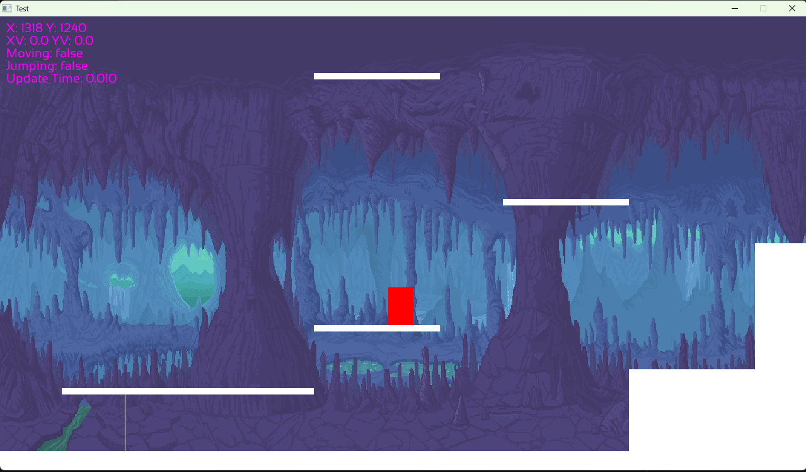
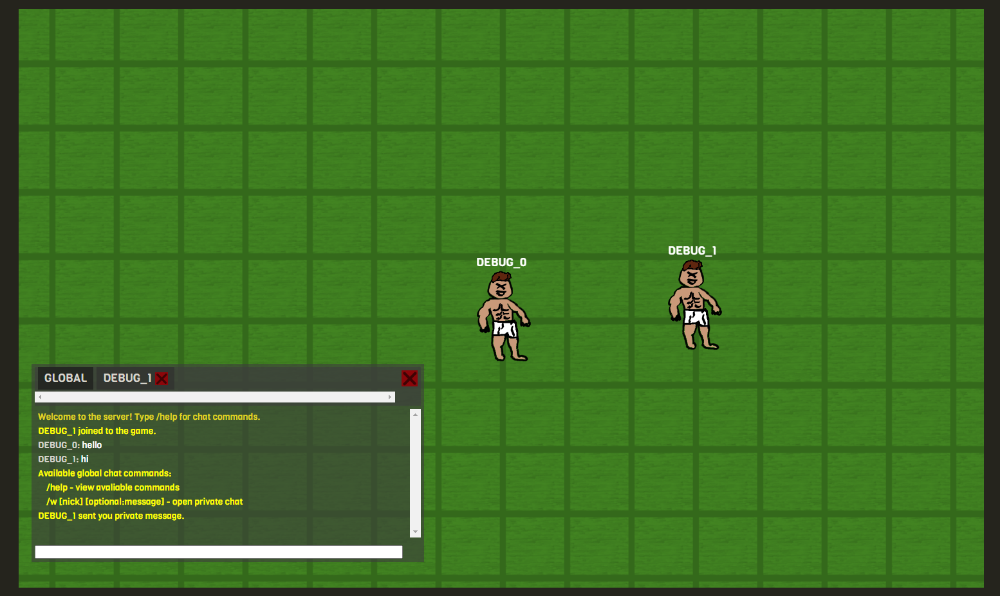
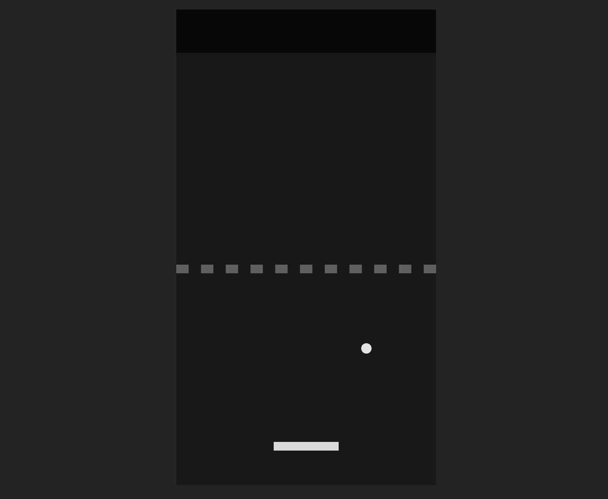

# About
These are some of my old projects from 2017 when I was learning programming.

## cpp-aabb-platformer
Playing with AABB collisions and gravity with C++ and SDL2.

## socket-io-game
Trying out Socket.IO to make simple top down game with game chat.

## js-pong
Unfinished pong game made with JavaScript.

